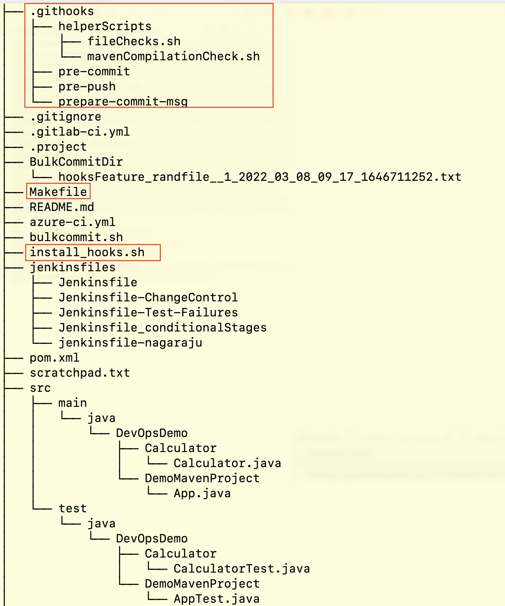

# Demo Maven Project with Git-Hooks

<!--  -->

This project contains a Maven project with tests. Git-Hooks are configured and being version controlled.

## Project Structure ::
<p align="center">
  

### Version controlled git-hooks:
* ProjectDirectory/.githooks
    >### pre-commit ::
    ```sh
    # ------------------- Check for white-space error -------------------- #
    # Check if this is the initial commit
    if git rev-parse --verify HEAD >/dev/null 2>&1
    then
        echo "pre-commit: About to create a new commit..."
        against=HEAD
    else
        echo "pre-commit: About to create the first commit..."
        against=4b825dc642cb6eb9a060e54bf8d69288fbee4904
    fi

    # Use git diff-index to check for whitespace errors
    echo "pre-commit: Testing for whitespace errors..."
    if ! git diff-index --check --cached $against
    then
        echo "pre-commit: Aborting commit due to whitespace errors"
        exit 1
    else
        echo "pre-commit: No whitespace errors :)"
        exit 0
    fi
    ```
    >### prepare-commit-msg ::
    ```sh
    #Append commit message with STRY, DEF, BAK tickets or MAINT

    COMMIT_MSG_FILE=$1
    COMMIT_SOURCE=$2
    SHA1=$3

    CURRENT_BRANCH=$(git rev-parse --abbrev-ref HEAD)
    # echo "CURRENT_BRANCH = "${CURRENT_BRANCH}
    PREFIX_REGEX="((DEF|BAK|STRY|MAINT|def|bak|stry|maint|TNTC)[0-9]*)"
    PREFIX_REGEX_UNDERSCORE="((DEF|BAK|STRY|MAINT|def|bak|stry|maint|TNTC)[0-9]*)(_*).*"
    PREFIX_REGEX_HYPHEN="((DEF|BAK|STRY|MAINT|def|bak|stry|maint|TNTC)[0-9]*)(-*).*"

    separator=""
    if [[ $CURRENT_BRANCH == "$PREFIX_REGEX"* ]]
    then
        if [[ $CURRENT_BRANCH == "$PREFIX_REGEX_UNDERSCORE"* ]]
        then
            #echo "branch name cotains underscore"
            separator="_"
        elif [[ $CURRENT_BRANCH == "$PREFIX_REGEX_HYPHEN"* ]]
        then
            #echo "branch name cotains hyphen"
            separator="-"
        fi
        arr=(${CURRENT_BRANCH//${separator}/ })
        # Modify the current branch value as only the workitem (def/stry/tntc) number
        CURRENT_BRANCH=${arr[0]}
    fi

    # echo "CURRENT_BRANCH = "${CURRENT_BRANCH} #

    # PREFIX_REGEX="((DEF|BAK|STRY|MAINT|def|bak|stry|maint|TNTC)[0-9]*)(_*).*"

    COMMIT_MESSAGE=$(cat $COMMIT_MSG_FILE)
    MIN_COMMIT_LENGTH=5
    COMMIT_MESSAGE_LENGTH=$(echo -n "$COMMIT_MESSAGE" | wc -c)

    if [[ $COMMIT_MESSAGE_LENGTH -lt $MIN_COMMIT_LENGTH ]]
    then
        echo 'COMMIT_MESSAGE_LENGTH = '$COMMIT_MESSAGE_LENGTH
        echo 'MIN_COMMIT_LENGTH = '$MIN_COMMIT_LENGTH
        echo 'Commit message is too short..... Commit --------------------------> [ABORTED]'
        exit 1;
    fi

    if [[ $CURRENT_BRANCH =~ $PREFIX_REGEX ]]
    then
        TICKET="${BASH_REMATCH[0]}"
        # echo "TICKET IS = "${TICKET}
        
        if [[ ! $COMMIT_MESSAGE =~ $TICKET ]]
        then
            echo "Ticket '${TICKET}', matched in current branch name, appended to commit message."

            if [[ $COMMIT_MESSAGE == "TEST"* ]] || [[ $COMMIT_MESSAGE == "test"* ]] || [[ $COMMIT_MESSAGE == "MAINT"* ]] || [[ $COMMIT_MESSAGE == "maint"* ]]
            then
                echo ${COMMIT_MESSAGE}" - "${TICKET} > $COMMIT_MSG_FILE
                echo "Ticket '${TICKET}', was appended to the commit message!......................"
                echo "Commit Status >------------------------------------------------> [SUCCESSFUL]"
            else
                echo "TEST: ${COMMIT_MESSAGE} - ${TICKET}" > $COMMIT_MSG_FILE
                echo "TEST: was pre-fixed to the commit message...................................."
                echo "Commit Status >------------------------------------------------> [SUCCESSFUL]"
            fi
        else
            if [[ $COMMIT_MESSAGE != "TEST"* ]] && [[ $COMMIT_MESSAGE != "test"* ]] && [[ $COMMIT_MESSAGE != "MAINT"* ]] && [[ $COMMIT_MESSAGE != "maint"* ]]
            then
                echo "TEST: ${COMMIT_MESSAGE}" > $COMMIT_MSG_FILE
                echo "TEST: was pre-fixed to the commit message...................................."
                echo "Commit Status >------------------------------------------------> [SUCCESSFUL]"
            fi
        fi

    elif [[ $COMMIT_MESSAGE == "MAINT"* ]] || [[ $COMMIT_MESSAGE == "TEST"* ]] || [[ $COMMIT_MESSAGE == "test"* ]] || [[ $COMMIT_MESSAGE == "maint"* ]]
    then
        echo "Commit Status >------------------------------------------------> [SUCCESSFUL]"
        exit 0;
    else
        echo "TEST: "${COMMIT_MESSAGE} > $COMMIT_MSG_FILE
        echo "TEST: was pre-fixed to the commit message...................................."
        echo "Commit Status >------------------------------------------------> [SUCCESSFUL]"
    fi
    ```
    >### pre-push ::
    ```sh
    # ------------------- Compile Maven Project -------------------- #

    #changes directory to glide-template and runs mvn clean verify

    CWD=`pwd`

    # Get the path of the files which are getting modified
    # need to write code

    # Move to the project directory which you want to compile

    mvn test-compile
    if [ $? -ne 0 ]; then
    cd $CWD
    echo 'Git Push [ABORTED] >-----------> because of existing issues, Please check logs!'
    exit 1
    else
        echo 'Compilation Status: No issues found >--------------------------> [SUCCESSFUL]'
        echo 'Git Push >-----------------------------------------------------> [SUCCESSFUL]'
    fi
    cd $CWD
    ```

    >## Master git-hooks installer:
    * ProjectDirectory/install_hooks.sh
    ```sh
    #Installs the hooks into your githooks directory

    printf "This script will copy the following hooks to your .git/hooks directory:\n\n"
    for hook in $(ls .githooks)
    do
    echo $hook
    done
    printf "\n\n"
    read -r -p "Please enter Y to continue: " RESPONSE

    if [[ "$RESPONSE" =~ ^([yY][eE][sS]|[yY])$ ]]
    then
        cd .githooks
        for hook in $(ls)
        do
            cp $hook ../.git/hooks
        done
        cd ..
    fi

    echo "Hooks installed successfully"
    ```

  >## Makefile for setups:
  * makefile
  ```makefile
    all: say_hello change_hooks_config
    # all: say_hello generate_textfiles clean_textfiles
    # Note - First Line of the make file is always the default goal/target 
        # so, it gets executed everytime
    say_hello:
            echo "Hello World"

    generate_textfiles:
            @echo "Creating empty text files..."
            touch file-{1..10}.txt

    clean_textfiles:
            sleep 2
            @echo "Cleaning up..."
            rm *.txt

    build_project:
            echo "Building the maven project"
            mvn clean verify -Dmaven.test.skip=true

    install_hooks:
            echo "Running install_hooks.sh"
            ./install_hooks.sh

    change_hooks_config:
            echo "Modifying git hook config"
            git config core.hooksPath .githooks
  ```


<!-- * [MobX](https://github.com/mobxjs/mobx) -->


## How It Works

1. This project contains a hidden directory `.githooks` under which there are two git-hooks (a). `pre-commit` and (b). `prepare-commit-msg`
2. Inside the project directory we have a shell script file `install_hooks.sh` which actually installs (or basically copies the .githooks/ files to the `.git/hooks` directory)
3. There is a `Makefile` inside the project directory which is an easy to go step to do all the githooks setups in just one signle shot command which is `make`.

* make file will first of all run ./install_hooks.sh or just set the `git config core.hooksPath`.
* <b>pre-commit</b> script looks for white-space errors in any of the newly added or modified files.
* <b>pre-push</b> has the code to build the project using maven comamnd `mvn clean verify -Dmaven.test.skip=true` before doing the actual push to the remote repository.
* <b>prepare-commit-msg</b> has code to update commit message according to the branch name. If the branch name contains any defect, story or testcase number in that case the same will be appended to the start of the commit message also.

<!-- <details><summary><b>Show instructions</b></summary>

1. Setup:

    ```sh
    $make
    ``` 
</details>
-->


### Setup
* Fire Below command inside the project directory ::
    ```sh
    make
    ```
   
